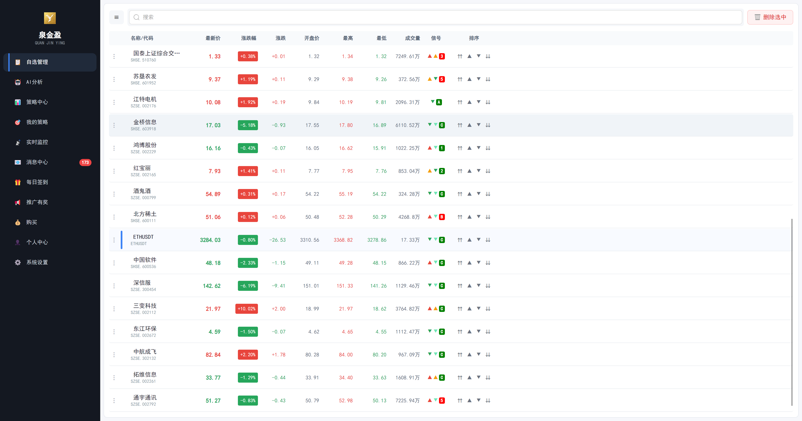
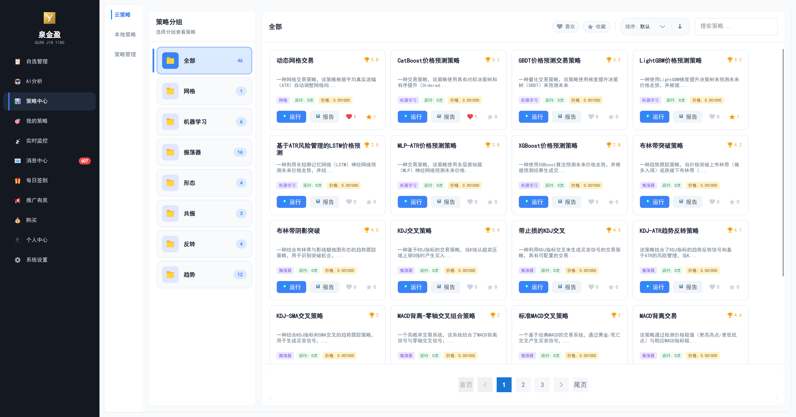
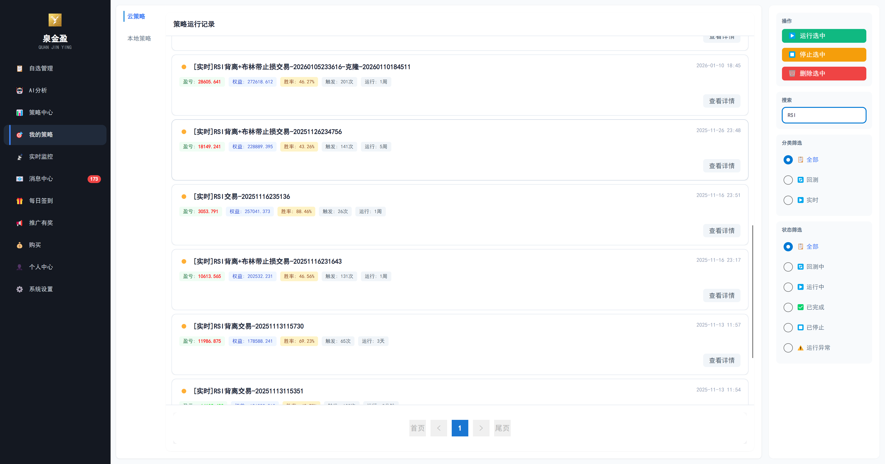
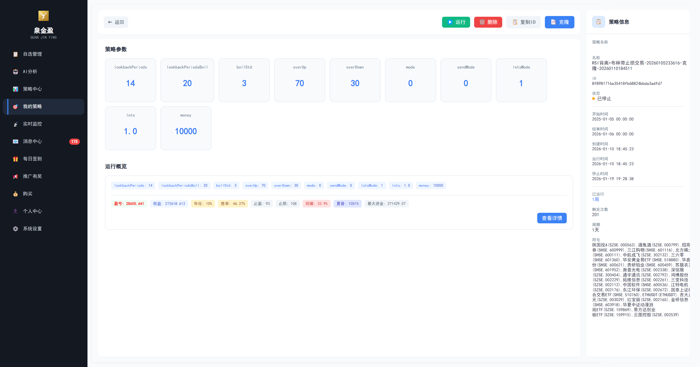
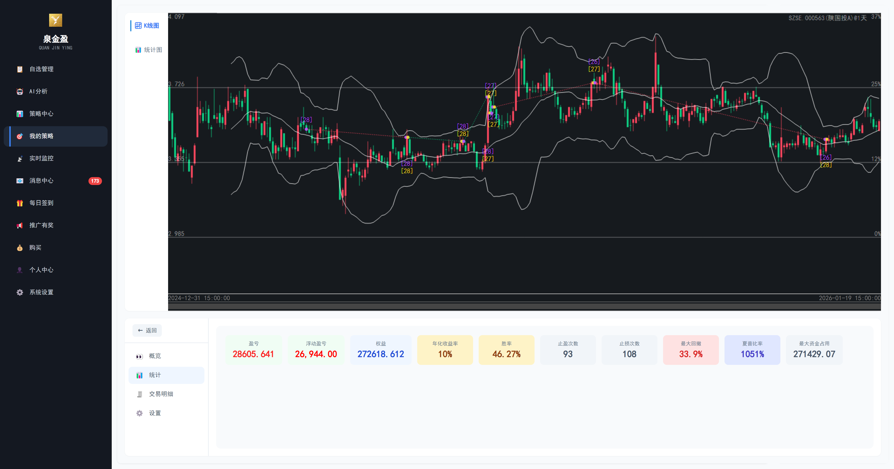
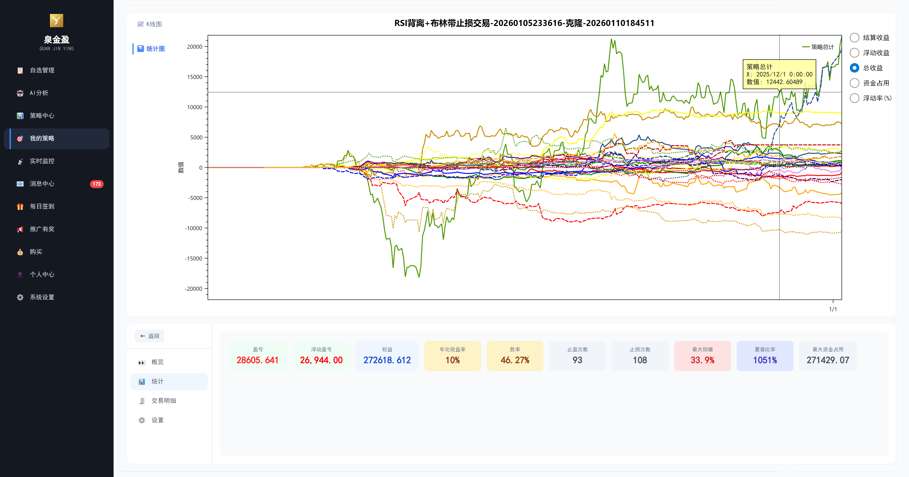
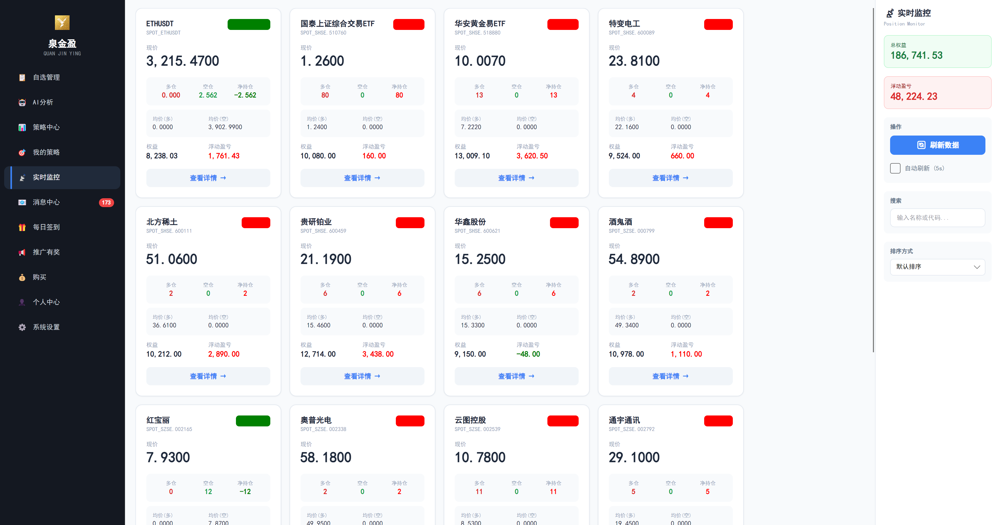
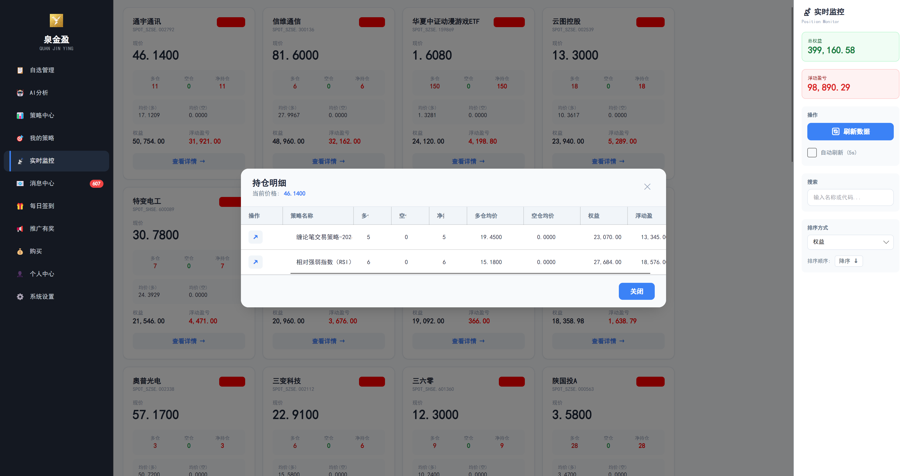
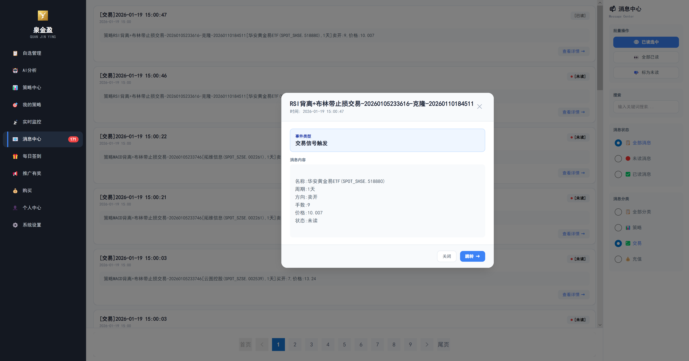
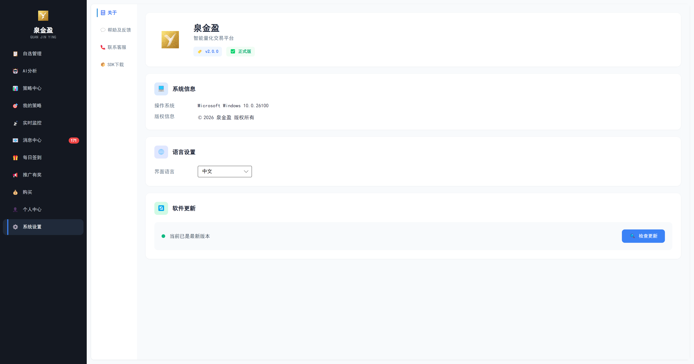

<p align="center">
  
</p>

<h1 align="center">泉金盈 - SDK</h1>

<p align="center">
  <strong>专业量化策略开发工具包</strong>
</p>

<p align="center">
  
  
  
</p>

---

## 目录

- [概述](#概述)
- [立即体验](#立即体验)
- [官方维护的策略](#官方维护的策略)
  - [趋势跟踪类 (Trend)](#趋势跟踪类-trend)
  - [震荡指标类 (Oscillator)](#震荡指标类-oscillator)
  - [形态识别类 (Pattern)](#形态识别类-pattern)
  - [反转策略类 (Reversal)](#反转策略类-reversal)
  - [量化因子类 (Quant)](#量化因子类-quant)
  - [共振策略类 (Resonance)](#共振策略类-resonance)
  - [网格交易类 (Grid)](#网格交易类-grid)
  - [机器学习类 (MachineLearning)](#机器学习类-machinelearning)
- [泉金盈客户端功能](#泉金盈客户端功能)
- [SDK 功能特性](#sdk-功能特性)
- [系统要求](#系统要求)
- [快速开始](#快速开始)
- [核心类说明](#核心类说明)
- [API 参考](#api-参考)
- [示例代码](#示例代码)
- [技术支持](#技术支持)

---

## 概述

**泉金盈策略开发 SDK** 是泉金盈量化交易平台的官方策略开发工具包，为开发者提供标准化的策略开发接口。通过本 SDK，您可以快速开发、调试并部署自定义量化交易策略至泉金盈平台。

### 核心优势
- **全平台支持** - 支持Windows/Mac/Linux/Android/iOS/Web
- **超强可视化** - 覆盖99%指标绘制标准，策略信号可视化展示及联动
- **多市场支持** - 覆盖加密货币、股票、期货等交易市场
- **双策略模式** - 支持本地/云端策略运行，极速回测，稳定易用
- **消息推送** - 支持邮件/钉钉消息推送，及时获取策略信号通知
- **无偏离设计** - 从底层保证信号不会偏移，确保策略信号的真实有效性
- **实时数据** - 毫秒级行情推送，支持多周期 K 线数据
- **标准化接口** - 统一的策略开发规范，自由易扩展，降低学习成本

### 立即体验

即刻下载/在线体验泉金盈量化交易平台的强大功能：

<p align="center">
  <a href="https://www.ysykj.top"></a>
  &nbsp;&nbsp;
  <a href="https://qjycdn.ysykj.top"></a>
</p>

---

## 官方维护的策略

SDK 内置了丰富的量化交易策略，按类型分类如下：

#### 趋势跟踪类 (Trend)
| 策略名称 | 文件 | 简介 |
|---------|------|------|
| Aberration 通道突破 | `Aberration.cs` | 基于肯特纳通道的经典趋势跟踪系统，突破上轨做多、突破下轨做空 |
| Andromeda 趋势策略 | `Andromeda.cs` | 多重EMA+动量+波动率过滤的中长期趋势跟踪系统 |
| 布林带策略 | `Boll.cs` | 标准布林带交易策略，突破上轨做多、突破下轨做空、回归中轨平仓 |
| 唐奇安通道 ATR | `DonchianATR.cs` | 唐奇安通道突破+ATR金字塔加仓策略 |
| 唐奇安通道 | `DonchianChannel.cs` | 经典唐奇安通道突破策略，突破N日高点做多、突破N日低点做空 |
| Dual Thrust 策略 | `DualThrust.cs` | 经典日内突破系统，基于前N日价格计算动态突破区间 |
| EMA + ADX 趋势 | `EMA_ADX.cs` | 圣杯策略，强趋势中价格回调到EMA时顺势入场 |
| EMA + ADX + DI 趋势 | `EMA_ADX_DI.cs` | DI交叉+EMA趋势过滤+ADX强度确认的趋势动量策略 |
| EMA 标准策略 | `EMA_Standard.cs` | 快慢EMA交叉交易系统，支持趋势过滤和止损止盈 |
| 均线交叉 | `MACross.cs` | 经典双均线金叉死叉交易策略 |
| 动量突破 | `MomentumBreakout.cs` | MACD+RSI+成交量+ADX多重确认的动量突破策略 |
| RUMI 策略 | `RUMI.cs` | 相对动量指标系统，结合动量、趋势和波动率的综合交易系统 |
| SMA 均线策略 | `SMA.cs` | 标准SMA双均线交叉策略，支持趋势过滤和价格确认 |
| 海龟交易法则 | `TurtleTrading.cs` | 经典海龟交易系统，唐奇安通道突破+ATR仓位管理+金字塔加仓 |

#### 震荡指标类 (Oscillator)
| 策略名称 | 文件 | 简介 |
|---------|------|------|
| 布林带影线策略 | `Boll_Shadow.cs` | 布林带结合K线影线形态的交易策略 |
| KDJ 策略 | `KDJ.cs` | 标准KDJ交易策略，K/D金叉死叉+超买超卖区域过滤 |
| KDJ + 成交量 | `KDJV.cs` | KDJ指标结合成交量确认的交易策略 |
| KDJ + ATR | `KDJ_ATR.cs` | KDJ信号+ATR动态止损止盈的交易策略 |
| KDJ + RSI | `KDJ_RSI.cs` | KDJ与RSI双震荡指标共振交易策略 |
| KDJ + SMA | `KDJ_SMA.cs` | KDJ信号+SMA均线趋势过滤的交易策略 |
| MACD 背离零轴交叉 | `MACDDivergenceZeroCross.cs` | MACD背离+零轴交叉组合交易系统，支持多种组合模式 |
| MACD 标准策略 | `MACDStandard.cs` | 经典MACD金叉死叉交易系统 |
| MACD 背离策略 | `MACD_Deviate.cs` | MACD顶底背离交易策略 |
| MACD 背离 + 布林带 | `MACD_Deviate_Boll.cs` | MACD背离+布林带过滤的组合交易策略 |
| MACD + KDJ 交叉 | `MACD_KDJ_Cross.cs` | MACD与KDJ双指标金叉死叉共振交易系统 |
| RSI 策略 | `RSI.cs` | 标准RSI交易策略，支持超买超卖反转、中轴穿越、双RSI交叉 |
| RSI 背离 + 均线 | `RSIDivergenceMA.cs` | RSI背离+均线过滤的交易系统，自动识别趋势/震荡市场 |
| RSI 背离策略 | `RSI_Deviate.cs` | RSI顶底背离交易策略 |
| RSI 背离 + 布林带 | `RSI_Deviate_Boll.cs` | RSI背离+布林带过滤的组合交易策略 |

#### 形态识别类 (Pattern)
| 策略名称 | 文件 | 简介 |
|---------|------|------|
| 缠论策略 | `ChanLun.cs` | 完整缠论交易系统：K线包含处理、分型、笔、线段、中枢、背驰、买卖点 |
| 缠论笔交易 | `ChanLun_bi.cs` | 基于缠论笔结构的简化交易策略 |
| 道氏理论 | `DowTheory.cs` | 基于道氏理论的波峰波谷趋势识别交易策略 |
| 艾略特波浪 | `ElliottWave.cs` | 艾略特波浪理论交易策略，识别浪3/浪5入场点 |
| MACD + 三红兵 | `MACD_ThreeRedSoldiers.cs` | MACD动量+红三兵/三只乌鸦K线形态组合策略 |

#### 反转策略类 (Reversal)
| 策略名称 | 文件 | 简介 |
|---------|------|------|
| 自适应均值回归 | `AdaptiveMeanReversion.cs` | 布林带+RSI+Keltner通道多重确认的自适应均值回归策略 |
| 布林带均值回归 | `BollingerMeanReversion.cs` | 价格触及布林带轨道后回归中轨的均值回归交易系统 |
| 唐奇安反转 | `DonchianReverse.cs` | 基于唐奇安通道的反转交易策略 |
| ML 自适应均值回归 | `MLAdaptiveMeanReversion.cs` | 基于GBDT机器学习预测回归概率的智能均值回归策略 |
| 反转策略 | `Reverse.cs` | 价格极端偏离后的反转交易策略，支持金字塔加仓 |
| 影线反转 | `ReverseShadow.cs` | 基于K线长影线形态的反转交易策略 |
| 统计套利 | `StatisticalArbitrage.cs` | 基于Z-Score和半衰期的统计套利策略 |
| 夜神抄底 | `YeShenChaoDi.cs` | RSI超卖+价格企稳反转信号的抄底策略 |

#### 量化因子类 (Quant)
| 策略名称 | 文件 | 简介 |
|---------|------|------|
| 多因子策略 | `MultiFactor.cs` | 动量+趋势+波动率+成交量+均值回归五因子加权打分系统 |
| 多周期共振 | `MultiPeriodResonance.cs` | 多时间周期趋势共振交易系统，共振强度越高信号越强 |
| RSI 背离趋势延续 | `RSIDivergenceTrendContinuation.cs` | RSI反转背离+趋势延续背离双模式交易系统 |
| 三重因子共振 | `ThreeFactorResonance.cs` | MA趋势+MACD动量+OBV成交量三因子共振交易系统 |

#### 共振策略类 (Resonance)
| 策略名称 | 文件 | 简介 |
|---------|------|------|
| MACD + ADX 共振 | `MACD_ADX_Resonance.cs` | MACD动量信号+ADX/DI趋势强度双指标共振交易系统 |

#### 网格交易类 (Grid)
| 策略名称 | 文件 | 简介 |
|---------|------|------|
| 网格交易 | `GridTrading.cs` | 经典网格交易策略，支持动态网格（ATR自适应间距） |

#### 机器学习类 (MachineLearning)
| 策略名称 | 文件 | 简介 |
|---------|------|------|
| CatBoost 预测 | `CatBoostPredict.cs` | 基于CatBoost对称树+Ordered Boosting的价格预测策略 |
| GBDT 预测 | `GBDTPredict.cs` | 基于梯度提升决策树(GBDT)的价格预测策略 |
| LSTM 预测 | `LSTMPredict.cs` | 基于LSTM神经网络的时序价格预测策略 |
| LightGBM 预测 | `LightGBMPredict.cs` | 基于LightGBM的轻量级梯度提升价格预测策略 |
| MLP 预测 | `MLPPredict.cs` | 基于多层感知机(MLP)神经网络的价格预测策略 |
| XGBoost 预测 | `XGBoostPredict.cs` | 基于XGBoost二阶泰勒展开优化的价格预测策略 |

---

## 泉金盈客户端功能

本 SDK 需配合泉金盈客户端使用。泉金盈客户端是一款专业的智能量化交易平台，提供以下核心功能：

### 自选列表

| 功能 | 描述 |
|------|------|
| **品种管理** | 添加、删除、排序自选品种 |
| **实时行情** | 实时推送价格变动与涨跌幅 |
| **快速筛选** | 支持按名称、代码快速过滤 |

<p align="center">
  
</p>

### 策略中心

| 功能 | 描述 |
|------|------|
| **策略市场** | 海量公开策略，一键订阅使用 |
| **策略回测** | 历史数据回测验证策略效果 |
| **参数调优** | 智能参数优化与调参建议 |
| **策略上传** | 支持上传自研策略至云端 |

<p align="center">
  
</p>

### 我的策略

| 功能 | 描述 |
|------|------|
| **云端策略** | 云端托管运行的策略管理 |
| **本地策略** | 本地开发调试的策略管理 |
| **运行控制** | 启动、暂停、停止策略运行 |
| **绩效报告** | 详细的策略绩效与收益报告 |
| **交易明细** | 完整的交易订单记录查询 |

<p align="center">
  
</p>
<p align="center">
  
</p>
<p align="center">
  
</p>
<p align="center">
  
</p>

### 实时监控

| 功能 | 描述 |
|------|------|
| **持仓汇总** | 按品种汇总显示持仓情况 |
| **盈亏分析** | 实时浮动盈亏与收益率计算 |
| **策略关联** | 快速跳转至关联策略详情 |

<p align="center">
  
</p>
<p align="center">
  
</p>

### 消息中心

| 功能 | 描述 |
|------|------|
| **系统通知** | 平台公告与系统消息 |
| **交易提醒** | 策略信号与成交通知 |
| **消息管理** | 已读标记与消息删除 |

<p align="center">
  
</p>

### 系统设置

| 功能 | 描述 |
|------|------|
| **语言切换** | 中文/英文界面切换 |
| **版本更新** | 在线检查与下载更新 |
| **问题反馈** | 建议、Bug 反馈提交 |

<p align="center">
  
</p>

---

## SDK 功能特性

| 功能 | 描述 |
|------|------|
| **K 线回调** | 支持 1 秒至日线多周期 K 线数据回调 |
| **交易下单** | 买入、卖出、平仓等订单类型支持 |
| **品种查询** | 获取交易品种详细信息 |
| **图表绑定** | 支持绑定曲线、矩形、文本等图形元素 |
| **参数配置** | 灵活的策略参数定义与配置 |

### 支持的周期

| 周期 | 枚举值 |
|------|--------|
| 1 秒 | `Period.TIME_1S` |
| 1 分钟 | `Period.TIME_1M` |
| 5 分钟 | `Period.TIME_5M` |
| 15 分钟 | `Period.TIME_15M` |
| 30 分钟 | `Period.TIME_30M` |
| 1 小时 | `Period.TIME_1H` |
| 2 小时 | `Period.TIME_2H` |
| 4 小时 | `Period.TIME_4H` |
| 日线 | `Period.TIME_1D` |

---

## 系统要求

| 项目 | 要求 |
|------|------|
| **.NET Runtime** | 9.0 或更高版本 |
| **操作系统** | Windows 10+ / macOS 10.15+ / Linux |
| **泉金盈客户端** | 需安装并运行泉金盈桌面客户端 |

---

## 快速开始

### 1. 克隆仓库

```bash
git clone https://github.com/lld1995/QjySDK.git
cd QjySDK
```

### 2. 还原依赖

```bash
dotnet restore
```

### 3. 编写策略

```csharp
using QjySDK.Stg;
using Model;

public class MyStrategy : StgBase
{
    public MyStrategy(string id) : base(id) { }

    public override StgDesc GetStgDesc()
    {
        return null; // 返回策略描述，或 null 使用默认配置
    }

    public override void OnBar(EnumDef.Period period, TableUnit tu, bool isFinal, SkQuote tq)
    {
        // 在此处理 K 线数据
        if (isFinal)
        {
            Console.WriteLine($"{tu.MktSymbol} - {period}: Close={tq.Close}");
        }
    }
}
```

### 4. 运行策略

```csharp
var strategy = new MyStrategy("my-strategy-id");
await strategy.Run();
```

> **注意**: 运行策略前请确保泉金盈客户端已启动并登录。

### 5. 在客户端创建本地策略

在泉金盈客户端中创建本地策略，关联您开发的策略程序：

<p align="center">
  
</p>

---

## 核心类说明

### StgBase

策略基类，所有自定义策略需继承此类。

| 成员 | 类型 | 描述 |
|------|------|------|
| `Id` | `string` | 策略唯一标识 |
| `ArgDic` | `Dictionary<string, object>` | 策略参数字典 |
| `GetStgDesc()` | 抽象方法 | 返回策略描述信息 |
| `OnBar()` | 虚方法 | K 线数据回调 |
| `OnPeriodEnd()` | 虚方法 | 周期结束回调 |
| `OnGlobalIndicator()` | 虚方法 | 全局指标计算回调 |
| `OnSendOrder()` | 虚方法 | 下单回调 |

### StgDesc

策略描述类，用于定义策略参数与配置。

| 属性 | 类型 | 描述 |
|------|------|------|
| `ArgDic` | `Dictionary<string, object>` | 参数默认值 |
| `ArgDescDic` | `Dictionary<string, ArgDesc>` | 参数描述 |
| `MaxSymbolNum` | `int` | 最大品种数量 |
| `SubChartNum` | `int` | 副图数量 |
| `ColorDic` | `Dictionary<string, string>` | 颜色配置 |

### TableUnit

K 线数据容器。

| 属性 | 类型 | 描述 |
|------|------|------|
| `MktSymbol` | `string` | 品种标识 |
| `Period` | `Period` | 周期 |
| `QuoteList` | `List<SkQuote>` | K 线数据列表 |

### SkQuote

单根 K 线数据。

| 属性 | 类型 | 描述 |
|------|------|------|
| `Open` | `decimal` | 开盘价 |
| `High` | `decimal` | 最高价 |
| `Low` | `decimal` | 最低价 |
| `Close` | `decimal` | 收盘价 |
| `Volume` | `decimal` | 成交量 |

### OnBar 回调说明

`OnBar` 方法的 `isFinal` 参数含义：

| isFinal | 说明 |
|---------|------|
| `true` | K 线已完结，数据会追加至 `QuoteList` |
| `false` | 实时 Tick 数据，仅支持实时行情，不追加至历史列表 |

> **注意**: 当 `isFinal=false` 时为实时 Tick 推送，适用于需要逐笔行情的高频策略。

---

## API 参考

### 交易方法

```csharp
// 下单交易
void Trade(string mktSymbol, OrderType ot, decimal price, decimal num, Period p, int sendMode)
```

**参数说明**:
- `mktSymbol`: 品种标识
- `ot`: 订单类型 (BUY / SELL / BUY_TO_COVER / SELL_TO_COVER)
- `price`: 价格
- `num`: 数量
- `p`: 周期
- `sendMode`: 发送模式

### 绑定方法

```csharp
// 绑定图形元素
void Plot(string chartName, string name, PlotType pt, double? val, object extra = null)
```

**PlotType 枚举**:
- `LINE` - 直线
- `CURVE` - 曲线
- `RECTANGLE` - 矩形
- `XLINE` - 水平线
- `POINT` - 点
- `TEXT` - 文本
- `LINE_SEGMENT` - 线段

### 品种查询

```csharp
// 异步获取品种信息
Task<Symbol> GetSymbolAsync(string mktSymbol)

// 同步获取品种信息
Symbol GetSymbol(string mktSymbol)
```

---

## 策略示例展示

以下是基于本 SDK 开发的策略在泉金盈客户端中的运行效果：

### MACD-布林带偏离策略

<p align="center">
  
</p>

### 三重因子共振策略

<p align="center">
  
</p>

### RSI 背离与布林带策略

<p align="center">
  
</p>

### 缠论笔交易策略

<p align="center">
  
</p>

---

## 示例代码

### 简单均线策略

```csharp
public class MaStrategy : StgBase
{
    public MaStrategy(string id) : base(id) { }

    public override StgDesc GetStgDesc()
    {
        var desc = new StgDesc();
        desc.ArgDic["period"] = 20;
        return desc;
    }

    public override void OnBar(EnumDef.Period period, TableUnit tu, bool isFinal, SkQuote tq)
    {
        if (!isFinal || tu.QuoteList.Count < 20) return;

        var closes = tu.QuoteList.TakeLast(20).Select(q => (double)q.Close);
        var ma = closes.Average();

        Plot("main", "MA20", PlotType.CURVE, ma);

        if (tq.Close > (decimal)ma)
        {
            Trade(tu.MktSymbol, OrderType.BUY, tq.Close, 1, period, 0);
        }
    }
}
```

---

## 技术支持

| 渠道 | 联系方式 |
|------|----------|
| **官方网站** | [https://www.ysykj.top](https://www.ysykj.top) |
| **技术支持** | 411050567@qq.com |
| **商务合作** | 暂不支持 |

---

## 许可证

Copyright © 2024-2026 泉金盈 版权所有

本 SDK 为商业软件，仅限泉金盈平台注册用户使用。未经授权不得复制、修改或分发。

---

<p align="center">
  <sub>Powered by 泉金盈</sub>
</p>
