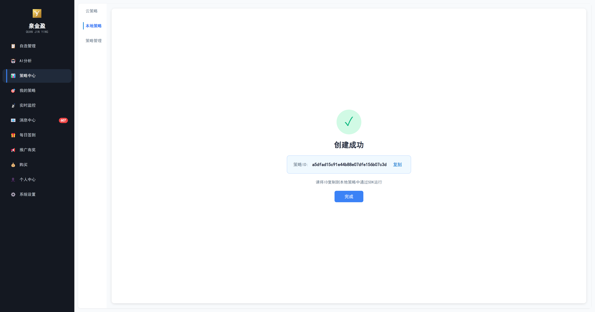
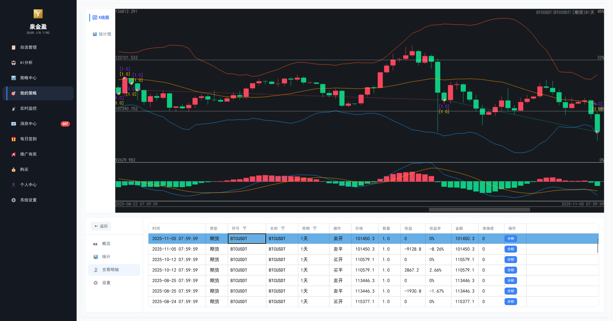
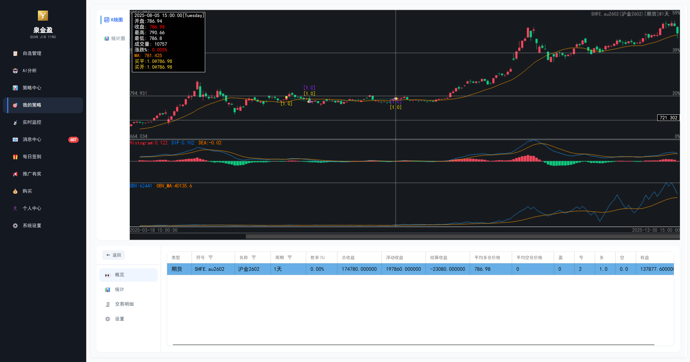
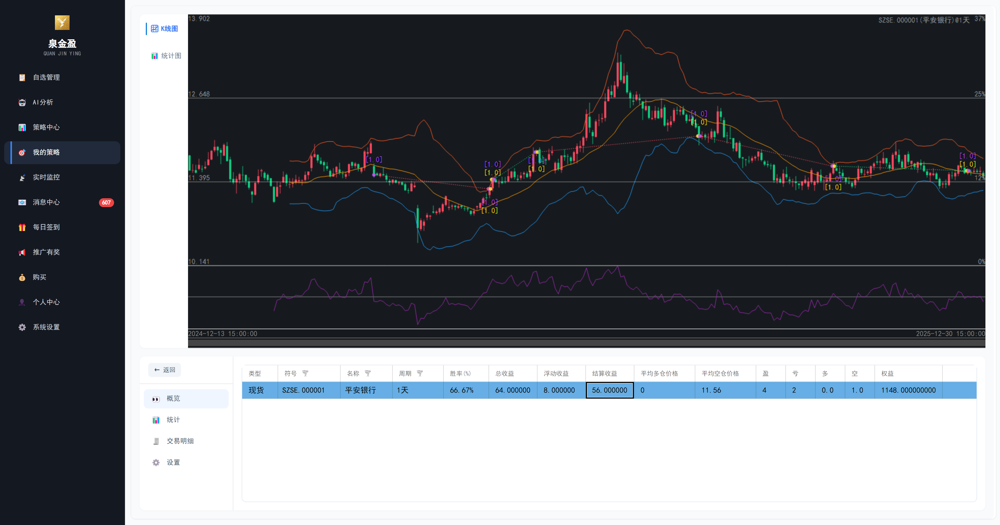
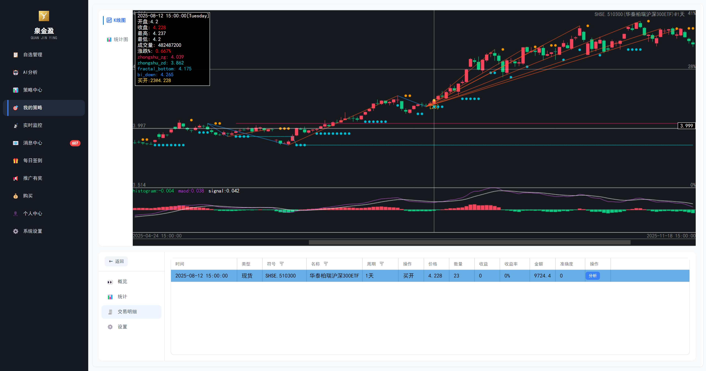

<p align="center">
  
</p>

<h1 align="center">QuanJinYing - SDK</h1>

<p align="center">
  <strong>Professional Quantitative Strategy Development Toolkit</strong>
</p>

<p align="center">
  <a href="README.md">简体中文</a> | <strong>English</strong>
</p>

<p align="center">
  
  
  
</p>

---

## Table of Contents

- [Overview](#overview)
- [Try It Now](#try-it-now)
- [Official Strategies](#official-strategies)
  - [Trend Following (Trend)](#trend-following-trend)
  - [Oscillator (Oscillator)](#oscillator-oscillator)
  - [Pattern Recognition (Pattern)](#pattern-recognition-pattern)
  - [Reversal Strategies (Reversal)](#reversal-strategies-reversal)
  - [Quantitative Factors (Quant)](#quantitative-factors-quant)
  - [Resonance Strategies (Resonance)](#resonance-strategies-resonance)
  - [Arbitrage Strategies (Arbitrage)](#arbitrage-strategies-arbitrage)
  - [Volatility Strategies (Volatility)](#volatility-strategies-volatility)
  - [Grid Trading (Grid)](#grid-trading-grid)
  - [Machine Learning (MachineLearning)](#machine-learning-machinelearning)
  - [Polymarket Strategies (Polymarket)](#polymarket-strategies-polymarket)
- [SDK Features](#sdk-features)
- [System Requirements](#system-requirements)
- [Quick Start](#quick-start)
- [Core Classes](#core-classes)
- [API Reference](#api-reference)
- [Code Examples](#code-examples)
- [Technical Support](#technical-support)

---

## Overview

**QuanJinYing Strategy Development SDK** is the official strategy development toolkit for the QuanJinYing quantitative trading platform, providing developers with standardized strategy development interfaces. With this SDK, you can quickly develop, debug, and deploy custom quantitative trading strategies to the QuanJinYing platform.

<p align="center">
  <a href="https://qjydownload.cdn.bcebos.com/product.mp4">
    
  </a>
  <br>
  <sub>🎬 Click the image above to watch the product video</sub>
</p>

### Core Advantages
- **Cross-Platform Support** - Windows/Mac/Linux/Android/iOS/Web
- **Powerful Visualization** - Covers 99% of indicator drawing standards, strategy signal visualization and linkage
- **Multi-Market Support** - Covers cryptocurrency, stocks, futures and other trading markets
- **Dual Strategy Mode** - Supports local/cloud strategy execution, fast backtesting, stable and easy to use
- **Message Push** - Supports email/DingTalk message push for timely strategy signal notifications
- **Zero Deviation Design** - Ensures signals never shift from the underlying level, guaranteeing signal authenticity
- **Real-Time Data** - Millisecond-level market data push, supports multi-period K-line data
- **Standardized Interface** - Unified strategy development specifications, flexible and extensible, reducing learning costs

### Try It Now

Download or experience the powerful features of QuanJinYing quantitative trading platform now:

<p align="center">
  <a href="https://www.ysykj.top"></a>
  &nbsp;&nbsp;
  <a href="https://qjycdn.ysykj.top"></a>
</p>

---

## Official Strategies

The SDK includes a rich set of quantitative trading strategies, categorized as follows:

####  Trend Following (Trend)
| Strategy Name | File | Description |
|--------------|------|-------------|
| Aberration Channel Breakout | `Aberration.cs` | Classic trend following system based on Keltner Channel, long on upper breakout, short on lower breakout |
| Andromeda Trend Strategy | `Andromeda.cs` | Multi-EMA + momentum + volatility filter for medium-long term trend following |
| Bollinger Bands Breakout | `Boll.cs` | Standard Bollinger Bands trading strategy, long on upper breakout, short on lower breakout, close at middle band |
| Donchian ATR | `DonchianATR.cs` | Donchian Channel breakout + ATR pyramid position sizing |
| Donchian Channel | `DonchianChannel.cs` | Classic Donchian Channel breakout, long on N-day high breakout, short on N-day low breakout |
| Dual Thrust Strategy | `DualThrust.cs` | Classic intraday breakout system, calculates dynamic breakout range based on previous N days |
| EMA + ADX Trend | `EMA_ADX.cs` | Holy Grail strategy, enter on pullback to EMA in strong trends |
| EMA + ADX + DI Trend | `EMA_ADX_DI.cs` | DI crossover + EMA trend filter + ADX strength confirmation |
| EMA Standard Strategy | `EMA_Standard.cs` | Fast/slow EMA crossover system with trend filter and stop loss/take profit |
| Moving Average Cross | `MACross.cs` | Classic dual moving average golden/death cross strategy |
| MACD Standard Strategy | `MACDStandard.cs` | Classic MACD golden/death cross system, EMA-based trend following |
| MACD + Fourier | `MACD_Fourier.cs` | MACD + Fourier transform cycle analysis, FFT noise filtering for trend confirmation |
| Momentum Breakout | `MomentumBreakout.cs` | MACD + RSI + Volume + ADX multi-confirmation momentum breakout |
| RUMI Strategy | `RUMI.cs` | Relative momentum indicator system combining momentum, trend and volatility |
| SMA Strategy | `SMA.cs` | Standard SMA dual crossover with trend filter and price confirmation |
| Turtle Trading | `TurtleTrading.cs` | Classic Turtle system, Donchian breakout + ATR position sizing + pyramid adding |

####  Oscillator (Oscillator)
| Strategy Name | File | Description |
|--------------|------|-------------|
| KDJ Strategy | `KDJ.cs` | Standard KDJ trading, K/D golden/death cross + overbought/oversold filter |
| KDJ + Volume | `KDJV.cs` | KDJ indicator with volume confirmation |
| KDJ + ATR | `KDJ_ATR.cs` | KDJ signals + ATR dynamic stop loss/take profit |
| KDJ + SMA | `KDJ_SMA.cs` | KDJ signals + SMA trend filter |
| RSI Strategy | `RSI.cs` | Standard RSI trading, supports overbought/oversold reversal, midline cross, dual RSI cross |
| RSI + Fourier | `RSI_Fourier.cs` | RSI + Fourier transform, long at cycle bottom oversold, short at top overbought |
| WR + Fourier | `WR_Fourier.cs` | Williams %R + Fourier transform, WR overbought/oversold with FFT cycle prediction |

####  Pattern Recognition (Pattern)
| Strategy Name | File | Description |
|--------------|------|-------------|
| Chan Theory Strategy | `ChanLun.cs` | Complete Chan Theory system: K-line inclusion, fractals, strokes, segments, pivots, divergence, buy/sell points |
| Chan Theory Stroke Trading | `ChanLun_bi.cs` | Simplified trading based on Chan Theory stroke structure |
| Dow Theory | `DowTheory.cs` | Peak and trough trend identification based on Dow Theory |
| Elliott Wave | `ElliottWave.cs` | Elliott Wave theory trading, identifies Wave 3/Wave 5 entry points |
| MACD + Three Soldiers | `MACD_ThreeRedSoldiers.cs` | MACD momentum + Three White Soldiers/Three Black Crows patterns |

####  Reversal Strategies (Reversal)
| Strategy Name | File | Description |
|--------------|------|-------------|
| Adaptive Mean Reversion | `AdaptiveMeanReversion.cs` | Bollinger + RSI + Keltner Channel multi-confirmation adaptive mean reversion |
| Bollinger Mean Reversion | `BollingerMeanReversion.cs` | Mean reversion when price touches Bollinger Bands and returns to middle |
| Bollinger Shadow Reversal | `Boll_Shadow.cs` | Bollinger Bands combined with candlestick shadow reversal patterns |
| Donchian Reversal | `DonchianReverse.cs` | Reversal trading based on Donchian Channel |
| MACD Divergence Strategy | `MACD_Deviate.cs` | MACD top/bottom divergence trading, divergence signals trend reversal |
| MACD Divergence + Bollinger | `MACD_Deviate_Boll.cs` | MACD divergence + Bollinger Bands filter reversal strategy |
| MACD Divergence Zero Cross | `MACDDivergenceZeroCross.cs` | MACD divergence + zero line cross reversal system, supports multiple modes |
| ML Adaptive Mean Reversion | `MLAdaptiveMeanReversion.cs` | GBDT machine learning predicted reversion probability |
| Reversal Strategy | `Reverse.cs` | Reversal trading after extreme price deviation, supports pyramid adding |
| Shadow Reversal | `ReverseShadow.cs` | Reversal trading based on long candlestick shadows |
| RSI Divergence Strategy | `RSI_Deviate.cs` | RSI top/bottom divergence trading, divergence signals reversal |
| RSI Divergence + Bollinger | `RSI_Deviate_Boll.cs` | RSI divergence + Bollinger Bands filter reversal strategy |
| RSI Divergence + MA | `RSIDivergenceMA.cs` | RSI divergence + MA filter reversal system, auto-detects trend/range markets |
| Statistical Arbitrage | `StatisticalArbitrage.cs` | Z-Score and half-life based statistical arbitrage |
| YeShen Bottom Fishing | `YeShenChaoDi.cs` | RSI oversold + price stabilization reversal signals |

####  Quantitative Factors (Quant)
| Strategy Name | File | Description |
|--------------|------|-------------|
| Multi-Factor Strategy | `MultiFactor.cs` | Momentum + Trend + Volatility + Volume + Mean Reversion five-factor weighted scoring |
| RSI Divergence Trend Continuation | `RSIDivergenceTrendContinuation.cs` | RSI reversal divergence + trend continuation divergence dual mode |
| Fourier Transform | `FourierTransform.cs` | FFT frequency domain analysis for cycle identification and trend prediction |

####  Resonance Strategies (Resonance)
| Strategy Name | File | Description |
|--------------|------|-------------|
| KDJ + RSI Resonance | `KDJ_RSI.cs` | KDJ and RSI dual oscillator resonance strategy |
| MACD + ADX Resonance | `MACD_ADX_Resonance.cs` | MACD momentum + ADX/DI trend strength dual indicator resonance |
| MACD + KDJ Resonance | `MACD_KDJ_Cross.cs` | MACD and KDJ dual indicator golden/death cross resonance system |
| Multi-Period Resonance | `MultiPeriodResonance.cs` | Multi-timeframe trend resonance, stronger signals with higher resonance |
| Three Factor Resonance | `ThreeFactorResonance.cs` | MA trend + MACD momentum + OBV volume three-factor resonance |
| CCI + MACD + Fourier | `CCI_MACD_Fourier.cs` | CCI + MACD + Fourier transform triple resonance, spectrum analysis for cycle and phase |
| RSI + Bollinger + Fourier | `RSI_Boll_Fourier.cs` | RSI + Bollinger + Fourier transform triple signal resonance for higher win rate |

####  Arbitrage Strategies (Arbitrage)

> Arbitrage strategies leverage the `OnGlobalIndicator` global calculation interface to access all symbol data simultaneously for cross-symbol analysis, enabling true multi-symbol arbitrage trading. All arbitrage strategies set `UseGlobalCalc = 1`.

| Strategy Name | File | Description |
|--------------|------|-------------|
| Pair Trading | `PairTrading.cs` | Classic pair trading strategy, calculates price ratio/spread Z-Score between symbols with cointegration half-life and correlation filtering, adaptive lookback period for mean reversion |
| Cross-Symbol Momentum | `CrossSymbolMomentum.cs` | Calculates composite momentum score (ROC+RSI+EMA) for all symbols and ranks them, long strongest and short weakest with periodic rebalancing, market-neutral strategy |
| Spread Arbitrage | `SpreadArbitrage.cs` | Builds global benchmark, calculates cumulative deviation Z-Score for each symbol vs benchmark, trades reversals on extreme deviations, naturally balanced long/short |
| Butterfly Arbitrage | `ButterflyArbitrage.cs` | Three-symbol butterfly spread (A+C-2B) mean reversion, auto-selects optimal middle leg, supports normalized spread to eliminate scale differences |
| Lead-Lag Arbitrage | `LeadLagArbitrage.cs` | Cross-correlation analysis discovers lead-lag relationships between symbols, positions in lagging symbols when leading symbols show significant moves |
| Mean Reversion Basket | `MeanReversionBasket.cs` | Builds winner/loser baskets by return ranking, bets on reversal when divergence is excessive, based on short-term reversal effect (Jegadeesh & Titman) |
| Cointegration Arbitrage | `CointegrationArbitrage.cs` | Engle-Granger two-step method, OLS regression for optimal hedge ratio, residual stationarity test + variance ratio test |

####  Volatility Strategies (Volatility)
| Strategy Name | File | Description |
|--------------|------|-------------|
| Volatility Breakout | `VolatilityBreakout.cs` | Bollinger Band Width Squeeze detection + ATR expansion confirmation, enters on trend when volatility expands sharply from low levels |
| Volatility Mean Reversion | `VolatilityMeanReversion.cs` | Trading based on historical volatility percentile ranking, contrarian mean reversion at high volatility, breakout at low volatility |
| Volatility Cone | `VolatilityCone.cs` | Multi-window (short/mid/long) volatility percentile analysis, high-confidence signals when multiple timeframes show consistent extremes |
| Volatility Adaptive Trend | `VolatilityAdaptiveTrend.cs` | Kaufman Adaptive Moving Average (KAMA) based, dynamically adjusts trend parameters and stop-loss distance based on volatility level |

####  Grid Trading (Grid)
| Strategy Name | File | Description |
|--------------|------|-------------|
| Grid Trading | `GridTrading.cs` | Classic grid trading, supports dynamic grid (ATR adaptive spacing) |
| Martingale Grid | `MartingaleGrid.cs` | Martingale position sizing grid, doubles lot size on each grid level down, takes profit at average price, with max layers and total stop-loss protection |
| Trend Grid | `TrendGrid.cs` | EMA trend detection + grid trading, long-only grid in uptrends, short-only grid in downtrends, auto-switches on trend reversal |
| Infinity Grid | `InfinityGrid.cs` | Geometric (proportional) grid strategy, each level spaced by fixed percentage, equal investment per grid, ideal for wide-ranging volatile assets |

####  Machine Learning (MachineLearning)
| Strategy Name | File | Description |
|--------------|------|-------------|
| CatBoost Prediction | `CatBoostPredict.cs` | Price prediction based on CatBoost symmetric trees + Ordered Boosting |
| GBDT Prediction | `GBDTPredict.cs` | Price prediction based on Gradient Boosting Decision Trees |
| LSTM Prediction | `LSTMPredict.cs` | Time series price prediction based on LSTM neural networks |
| LightGBM Prediction | `LightGBMPredict.cs` | Lightweight gradient boosting price prediction based on LightGBM |
| MLP Prediction | `MLPPredict.cs` | Price prediction based on Multi-Layer Perceptron neural networks |
| XGBoost Prediction | `XGBoostPredict.cs` | Price prediction based on XGBoost second-order Taylor expansion optimization |
| PCA Prediction | `PCAPredict.cs` | Dimensionality reduction and anomaly detection trading strategy based on Principal Component Analysis (PCA) |

####  Polymarket Strategies (Polymarket)

> Polymarket strategies support simultaneous trading on both the main exchange and [Polymarket](https://polymarket.com) prediction markets. Strategies automatically place orders on Polymarket based on signal direction. For key configuration, see [Polymarket Key Configuration](#polymarket-key-configuration).

| Strategy Name | File | Description |
|--------------|------|-------------|
| Extreme Reversal | `ExtremeReversal.cs` | 5-dimension reversal scoring: consecutive K-lines + RSI + StochK + volume + BB, trades reversal when all conditions reach extremes, ~60% win rate on ETH 5M |
| Mixture of Experts Prediction | `MoEPredict.cs` | 7-dimension extreme condition scoring, trades when 4+/7 conditions trigger simultaneously, a mixture-of-experts system fusing multiple technical indicators |

---

## SDK Features

| Feature | Description |
|---------|-------------|
| **K-Line Callback** | Supports 1-second to daily multi-period K-line data callback |
| **Trade Orders** | Buy, sell, close position and other order types |
| **Symbol Query** | Get detailed trading symbol information |
| **Chart Bindings** | Bind curves, rectangles, text and other graphical elements to charts |
| **Parameter Configuration** | Flexible strategy parameter definition and configuration |

### Supported Periods

| Period | Enum Value |
|--------|------------|
| 1 Second | `Period.TIME_1S` |
| 1 Minute | `Period.TIME_1M` |
| 5 Minutes | `Period.TIME_5M` |
| 15 Minutes | `Period.TIME_15M` |
| 30 Minutes | `Period.TIME_30M` |
| 1 Hour | `Period.TIME_1H` |
| 2 Hours | `Period.TIME_2H` |
| 4 Hours | `Period.TIME_4H` |
| Daily | `Period.TIME_1D` |

---

## System Requirements

| Item | Requirement |
|------|-------------|
| **.NET Runtime** | 9.0 or higher |
| **Operating System** | Windows 10+ / macOS 10.15+ / Linux |
| **QuanJinYing Client** | QuanJinYing desktop client must be installed and running |

---

## Polymarket Key Configuration

Polymarket strategies (ExtremeReversal, MoEPredict) require a wallet private key to place orders. Keys are configured via the `poly_secrets.txt` file. **Never hardcode keys in source code.**

### File Format

```
PRIVATE_KEY=0xYourPrivateKey
FUNDER_ADDRESS=0xYourProxyWalletAddress
RELAYER_API_KEY=your_relayer_api_key
ETHERSCAN_API_KEY=your_etherscan_key
PROXY_URL=http://127.0.0.1:7888
POLYGON_RPC=https://polygon-bor-rpc.publicnode.com
```

### File Location

The program searches for `poly_secrets.txt` in the following order, stopping at the first match:

1. **Project root directory** (recommended) — same level as `QjySDK.sln`
2. Runtime directory (`bin/Debug/net9.0/`)
3. User home directory (`%USERPROFILE%/poly_secrets.txt`)

>  **Security Note**: Make sure `poly_secrets.txt` is added to `.gitignore`. Never commit it to the repository.

### Strategy Parameter Priority

The `privateKey` and `funderAddress` strategy parameters default to empty. Loading order:

1. Client-configured strategy parameters (if manually set by user)
2. `PRIVATE_KEY` / `FUNDER_ADDRESS` from `poly_secrets.txt`
3. If both are empty, Polymarket initialization is skipped (exchange-only trading)

---

## Quick Start

### 1. Clone Repository

```bash
git clone https://github.com/lld1995/QjySDK.git
cd QjySDK
```

### 2. Restore Dependencies

```bash
dotnet restore
```

### 3. Write Strategy

```csharp
using QjySDK.Stg;
using Model;

public class MyStrategy : StgBase
{
    public MyStrategy(string id) : base(id) { }

    public override StgDesc GetStgDesc()
    {
        return null; // Return strategy description, or null for default config
    }

    public override void OnBar(EnumDef.Period period, TableUnit tu, bool isFinal, SkQuote tq)
    {
        // Process K-line data here
        if (isFinal)
        {
            Console.WriteLine($"{tu.MktSymbol} - {period}: Close={tq.Close}");
        }
    }
}
```

### 4. Run Strategy

```csharp
var strategy = new MyStrategy("my-strategy-id");
await strategy.Run();
```

> **Note**: Make sure the QuanJinYing client is started and logged in before running strategies.

### 5. Create Local Strategy in Client

Create a local strategy in the QuanJinYing client and associate it with your developed strategy program:

<p align="center">
  
</p>

---

## Core Classes

### StgBase

Base class for strategies. All custom strategies must inherit from this class.

| Member | Type | Description |
|--------|------|-------------|
| `Id` | `string` | Strategy unique identifier |
| `ArgDic` | `Dictionary<string, object>` | Strategy parameter dictionary |
| `GetStgDesc()` | Abstract method | Returns strategy description |
| `OnBar()` | Virtual method | K-line data callback |
| `OnPeriodEnd()` | Virtual method | Period end callback |
| `OnGlobalIndicator()` | Virtual method | Global indicator calculation callback |
| `OnSendOrder()` | Virtual method | Order callback |

### StgDesc

Strategy description class for defining strategy parameters and configuration.

| Property | Type | Description |
|----------|------|-------------|
| `ArgDic` | `Dictionary<string, object>` | Parameter default values |
| `ArgDescDic` | `Dictionary<string, ArgDesc>` | Parameter descriptions |
| `MaxSymbolNum` | `int` | Maximum number of symbols |
| `SubChartNum` | `int` | Number of sub-charts |
| `ColorDic` | `Dictionary<string, string>` | Color configuration |

### TableUnit

K-line data container.

| Property | Type | Description |
|----------|------|-------------|
| `MktSymbol` | `string` | Symbol identifier |
| `Period` | `Period` | Period |
| `QuoteList` | `List<SkQuote>` | K-line data list |

### SkQuote

Single K-line data.

| Property | Type | Description |
|----------|------|-------------|
| `Open` | `decimal` | Open price |
| `High` | `decimal` | High price |
| `Low` | `decimal` | Low price |
| `Close` | `decimal` | Close price |
| `Volume` | `decimal` | Volume |

### OnBar Callback Description

The `isFinal` parameter in `OnBar` method:

| isFinal | Description |
|---------|-------------|
| `true` | K-line is complete, data will be appended to `QuoteList` |
| `false` | Real-time tick data, only for live quotes, not appended to history |

> **Note**: When `isFinal=false`, it's real-time tick push, suitable for high-frequency strategies requiring tick-by-tick data.

---

## API Reference

### Trading Methods

```csharp
// Place trade order
void Trade(string mktSymbol, OrderType ot, decimal price, decimal num, Period p, int sendMode)
```

**Parameters**:
- `mktSymbol`: Symbol identifier
- `ot`: Order type (BUY / SELL / BUY_TO_COVER / SELL_TO_COVER)
- `price`: Price
- `num`: Quantity
- `p`: Period
- `sendMode`: Send mode

### Plot Methods

```csharp
// Bind graphical elements to chart
void Plot(string chartName, string name, PlotType pt, double? val, object extra = null)
```

**PlotType Enum**:
- `LINE` - Line
- `CURVE` - Curve
- `RECTANGLE` - Rectangle
- `XLINE` - Horizontal line
- `POINT` - Point
- `TEXT` - Text
- `LINE_SEGMENT` - Line segment

### Symbol Query

```csharp
// Async get symbol info
Task<Symbol> GetSymbolAsync(string mktSymbol)

// Sync get symbol info
Symbol GetSymbol(string mktSymbol)
```

---

## Strategy Examples

The following are running effects of strategies developed with this SDK in the QuanJinYing client:

### MACD-Bollinger Deviation Strategy

<p align="center">
  
</p>

### Three Factor Resonance Strategy

<p align="center">
  
</p>

### RSI Divergence and Bollinger Strategy

<p align="center">
  
</p>

### Chan Theory Stroke Trading Strategy

<p align="center">
  
</p>

---

## Code Examples

### Simple Moving Average Strategy

```csharp
public class MaStrategy : StgBase
{
    public MaStrategy(string id) : base(id) { }

    public override StgDesc GetStgDesc()
    {
        var desc = new StgDesc();
        desc.ArgDic["period"] = 20;
        return desc;
    }

    public override void OnBar(EnumDef.Period period, TableUnit tu, bool isFinal, SkQuote tq)
    {
        if (!isFinal || tu.QuoteList.Count < 20) return;

        var closes = tu.QuoteList.TakeLast(20).Select(q => (double)q.Close);
        var ma = closes.Average();

        Plot("main", "MA20", PlotType.CURVE, ma);

        if (tq.Close > (decimal)ma)
        {
            Trade(tu.MktSymbol, OrderType.BUY, tq.Close, 1, period, 0);
        }
    }
}
```

---

## Technical Support

| Channel | Contact |
|---------|---------|
| **Official Website** | [https://www.ysykj.top](https://www.ysykj.top) |
| **Technical Support** | 411050567@qq.com |
| **Business Cooperation** | Not available |

---

## License

Copyright © 2024-2026 QuanJinYing All Rights Reserved

This SDK is commercial software, only available for registered users of the QuanJinYing platform. Unauthorized copying, modification, or distribution is prohibited.

---

<p align="center">
  <sub>Powered by QuanJinYing</sub>
</p>
